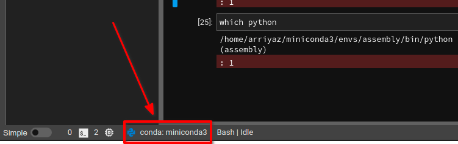
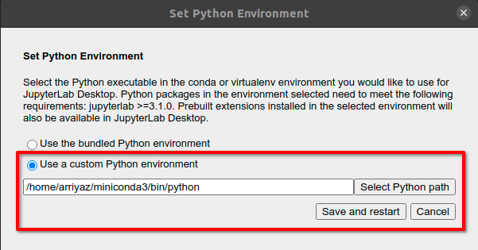

# Instructions and Steps for installing different tools in Linux

In linux distributions like ubuntu many times we have to install different tools and apps. Sometimes in case of some tools it becomes challenging to install that particular tools.
That's why I created this markdown file to document the process that I use to install different apps in my Ubuntu desktop.


## Install Lyx

**Step 1**

Run update command to update package repositories and get latest package information.
```shell
sudo apt-get update -y
```
**Step 2**

Run the install command with -y flag to quickly install the packages and dependencies.
```shell
sudo apt-get install -y lyx
```
Now you have successfully installed **lyx** in your ubuntu computer. But also have to install language package for ***latex*** uses as **lyx** use latex.

**Step 3**
To install **english** language package, run the  following command. For other language you can use similar codes.

```shell
sudo apt-get install -y texlive-lang-english
```

## Install Okular

**Step 1**

Run update command to update package repositories and get latest package information.
```shell
sudo apt-get update -y
```
**Step 2**

Run the install command with -y flag to quickly install the packages and dependencies.
```shell
sudo apt-get install -y okular
```

## Install Pinta

**Step 1**
First, install the [latest version of Mono](https://www.mono-project.com/download/stable/#download-lin)

For ubuntu 20.04
```shell
sudo apt install gnupg ca-certificates
sudo apt-key adv --keyserver hkp://keyserver.ubuntu.com:80 --recv-keys 3FA7E0328081BFF6A14DA29AA6A19B38D3D831EF
echo "deb https://download.mono-project.com/repo/ubuntu stable-focal main" | sudo tee /etc/apt/sources.list.d/mono-official-stable.list
sudo apt update
```
**Step 2**
Add Pinta stable PPA repository:
```shell
sudo add-apt-repository ppa:pinta-maintainers/pinta-stable
```
**Step 3**
Update system package list.
```shell
sudo apt-get update
```
**Step 3**
Install pinta:
```shell
sudo apt-get install pinta
```

## Set Python Environment in JupyterLab
When we install **JupyterLab** we have to set python environment path. By default we can use Jupyterlab's budndled environment. But to use it with different **conda environment** we should use **Custom Python environment**.

- For this purpose, first we have to install **jupyterlab**
tool in **base** environment inside our miniconda by followoing code.  
```bash
conda install jupyterlab
```
- Then click on the following option as indicated in the image.



- Then following dialog box will appear and we can set our custom environment.



