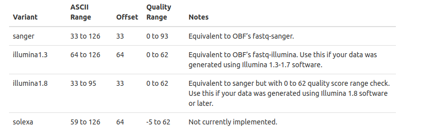

## Checking the Fastq files encoding
In this case we use a python script, which are stored in this directory (`guess-encoding.py`)
The original link of this python code is [guess-fastq-encoding](https://github.com/brentp/bio-playground/blob/master/reads-utils/guess-encoding.py)

Now run the follwoing code
```bash
cat inputfile.fastq |  awk 'NR % 4 == 0' | head -n 100000 | python guess-encoding.py
```
This code will check quality encoding for first 100000 reads. If you want to check whole fastq file omit the `head -n 100000` part of the code.

Example output:
```
# reading qualities from STDIN
Sanger,Illumina-1.8	35	71
```

## Choosing sequence for in Qiime2
While importing sequences in `qiime2` it is almost always challenging to identify sequence quality for the `--input-format` option of `qiime tools import` command.
After running the `guess-encoding.py` file, we can identify the **Phred Offset** from follwoing figure.


For more info about this idea, go to this [link](http://scikit-bio.org/docs/latest/generated/skbio.io.format.fastq.html#quality-score-variants)

- From this image we can see that our exmple fastq file is encoded with **Phred33**
- So, in `--input-format` option we will use `SingleEndFastqManifestPhred33V2`
- Here `V2` means the newer version of **manifest** file. For more explanation, go to this [link](https://forum.qiime2.org/t/the-difference-between-phred33-and-phred33v2/16738)


